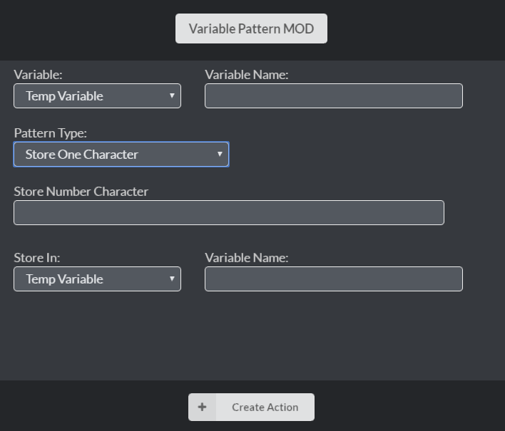

# DBM
Discord Bot Maker Raw Data & Mods & Scripts

## Installation
- Raw Data - Copy raw and paste to Command raw data
- Script - Copy raw and paste to Run Script action
- Mods - Download and paste to DBM action folder ("\steamapps\common\Discord Bot Maker\actions")

## Mods Preview
- Store Image Info
- Unban Member
- Check Parameter
- Check if Channel in Category
- Variable Pattern
- Delete Bulk Message
- Clone Channel
- Delete Member Data
- Delete Server Data
- Image Packs
  - Canvas Create Image
  - Canvas Draw Text on Image
  - Canvas Draw Image on Image
  - Canvas Image Options
  - Canvas Send Image

## Raw Data Preview
- curse_word_detect_event
- rank_command
- unban_command
- Invite_system

## Script Preview
- Ban Script
- Check if channel in a Category
- Speedtest.net Script

## Mods Function
- **Store Image Info** Store only image `dimension x` and `dimentions y` in pixel
- **Unban Member** Unban by `member id` or `member name`
- **Check Parameter** Added option `less than or equal` and `more than or equal`

- **Check if Channel in Catergory** Check go by `if true` and `if false`

- **Variable Pattern**  Change variable value by adding pattern include `Repeat every character`, `Change character to character`, `Add character to Front`, `Add character to End`, `Add character to Specific Position`, `Store character from front`, `Store character from end`, `Store one character`

- **Delete Bulk Message** Solved error inside event `TypeError: Cannot read property 'id' of undefined`
- **Clone Channel**
  - Text channel able to clone include `Channel Name`, `Slow Mode`, `NSFW`, `Topic`, `Permissions`
  - Voice channel able to clone include `Channel Name`, `User Limit`, `Bitrate`, `Permissions`
- **Delete Member Data** Delete specific member data or leave it blank to delete all member data
- **Delete Server Data** Delete specific server data or leave it blank to delete all server data

## Raw Data Function
- **curse_word_detect_event** This event will detect all message send by all of member and then detect if include in the `curse list`
- **rank_command** Require mod `Store Member Data List` A rank system allow find the command author `xp` data and rank in global
- **unban_command** unban by `Member_id`
- **Invite_system** This system will have 2 events, one event for getting store all invite code an refresh every 10 seconds. The other event getting which invite code when member join server

## Script Function
- **Ban Script** A ban system with bunch of function include `ban`, `unban`, `ban list`, `ban reason`, `ban member info`
- **Check if channel in a Category** Result will be `Category Object` if channel exist and inside category
- **Speedtest.net Script** Install `npm i speedtest-net`, test speed and send result in embed format

